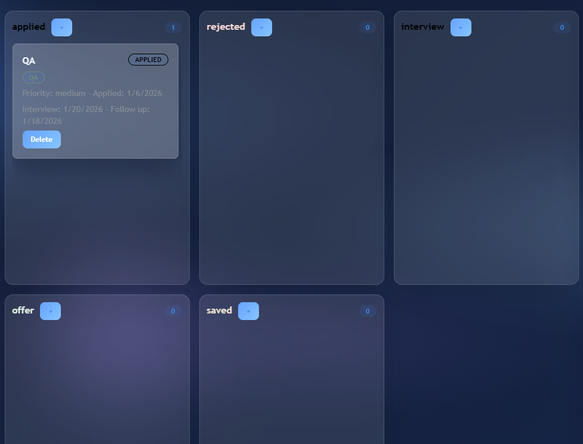
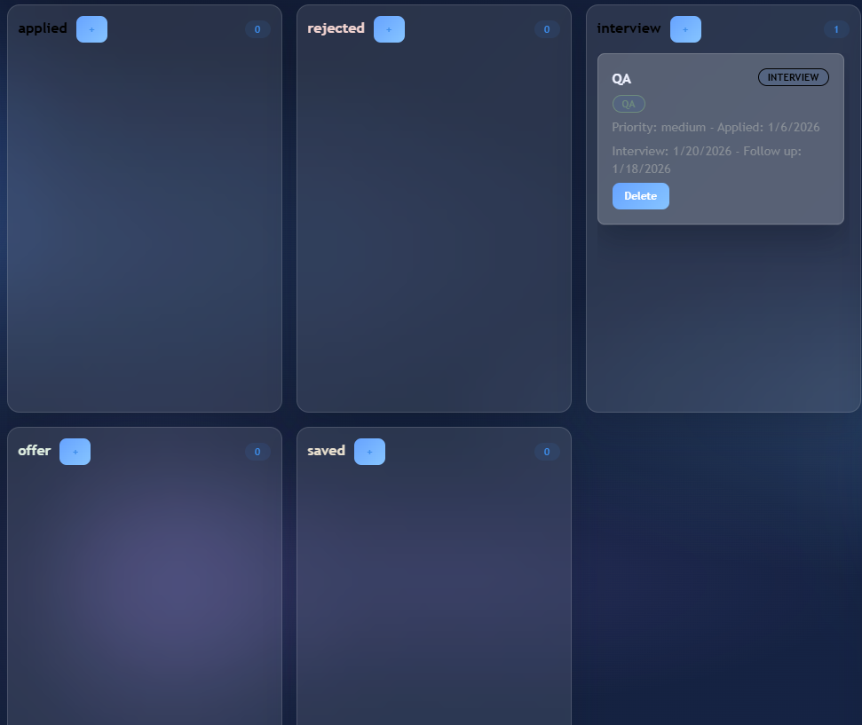
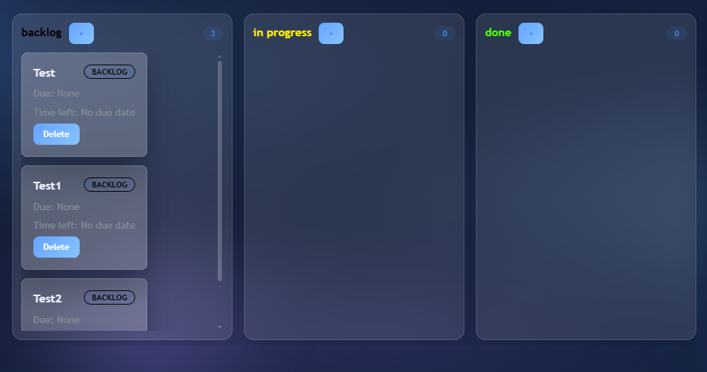
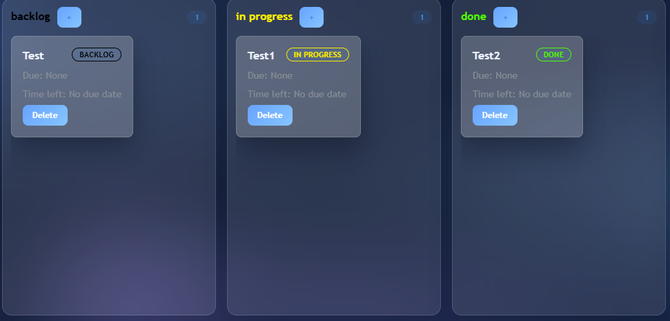

# TaskFlow

TaskFlow is a full-stack task + job management app I built as a student project.
It focuses on clean auth, real CRUD, and a kanban-style flow for both tasks and job applications.

## What it does

- Register / login / logout (JWT in HttpOnly cookies)
- Task board (drag cards between columns)
- Job board (track applications, interviews, follow ups)
- Custom columns + labels per user
- Admin pages: charts + user management
- Job calendar (dates + reminders)

## Tech stack

- Frontend: React, React Router, Mantine
- Backend: Node.js, Express
- DB: MongoDB + Mongoose
- Auth: JWT + HttpOnly cookies

## Project structure

```
apps/
  backend/
  frontend/
```

## How to run locally

1. Install deps

```
cd apps/backend
npm install
cd ../frontend
npm install
```

2. Create `apps/backend/.env`

```
PORT=5000
MONGODB_URI=mongodb://localhost:27017/taskflow
JWT_SECRET=your-secret
CLIENT_ORIGIN=http://localhost:5173
```

3. Start backend

```
cd apps/backend
npm run dev
```

4. Start frontend

```
cd apps/frontend
npm run dev
```

## Screenshots

These are in `apps/frontend/src/screenshots/`:





